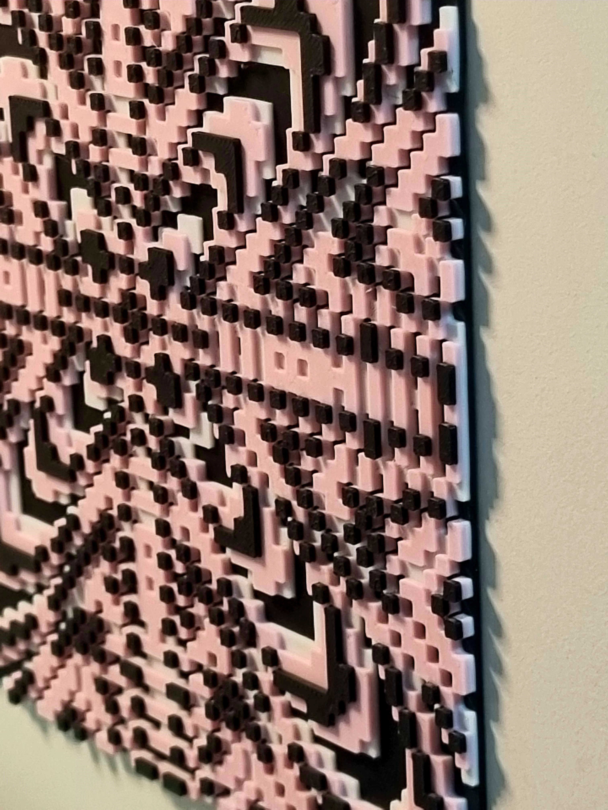

[English](README.md) | **한국어**

# Patternflow

**의미를 찾아가는 시간**

> *알고리즘이 쉴 새 없이 정보를 쏟아내는 지금, 우리는 같은 것을 보고 들으며 압도당합니다.*
>
> *이 흐름 속에서 자신만의 시선을 찾는 연습을 통해 나만의 아름다움을 발견할 수 있길 바랍니다.*

[데모 보기](https://patternflow.work) · [제작 스튜디오](https://patternflow.work/studio) · [소개](https://patternflow.work/about)

---

## 철학

> *"어떻게 보느냐가 무엇을 보느냐를 결정한다."*

Patternflow는 덜어냄을 통해 개성적인 시각을 발견하는 경험을 제공합니다.

수학적 파동의 밀도를 극단으로 높이면, 복잡하고 촘촘한 패턴이 나타납니다. 끊임없이 쏟아지는 현대의 정보처럼 압도적이죠. 이 연속적인 장을 규칙적인 그리드로 샘플링하고 높이와 색상을 부여하면, 새로운 형태가 드러납니다. 압도적이던 것이 읽기 쉬운 덩어리와 리듬으로 바뀌어갑니다.

이 작업은 관객에게 그 경계를 직접 조작하게 합니다. 단순한 슬라이더를 움직이며, 복잡함 속에서 개성적인 형태가 드러나는 순간을 탐험합니다. 발견한 형태는 화면 속에만 머물지 않고, 3D 프린팅을 통해 손에 쥘 수 있는 오브제로 가져갈 수 있습니다. 그리드는 단순한 도구가 아니라, 무엇을 볼지 결정하는 렌즈입니다. 하나의 패턴도 어떻게 보느냐에 따라 다른 형태가 됩니다.

*우리는 같은 세상을 각자의 방식으로 해석하는 방법을 배워야 합니다. 무엇을 선별하고 어떻게 증강하는가. 이것이 우리가 세상을 바라보는 방법입니다.*

---

## 주요 기능

- **인터랙티브 패턴 생성** — 파동 함수, 그리드 밀도, 시각적 변수를 실시간으로 조작하여 나만의 패턴을 만듭니다
- **URL 공유** — 생성한 패턴을 URL로 손쉽게 공유할 수 있습니다. 패턴 데이터가 링크에 압축 인코딩되어, 다른 사람이 바로 열어볼 수 있습니다
- **다양한 내보내기** — 디지털 소장용 PNG 이미지 및 3D 프린팅을 위한 OBJ/STL 파일 변환을 지원합니다
- **물리적 결과물** — 화면 속의 패턴을 넘어, 실제로 손에 쥘 수 있는 3D 프린팅 부조(Relief)로 제작될 수 있도록 설계되었습니다

---

## 3D 프린팅 예시

Patternflow에서 디자인한 패턴을 3D 프린팅하여 실물 벽 오브제로 제작할 수 있습니다.

| 큐브 | 디테일 |
|:------:|:------:|
|  |  |

---

## 작가

**이승훈 (Seung Hun Lee)**

저는 홍익대학교에서 시각디자인을 전공하고 있는 이승훈입니다.

드로잉보다는 코드를 짜고 노드를 연결해 구조를 만드는 일을 더 좋아합니다. 시스템을 구축한 후 변수 하나를 바꿨을 때 전체 형상이 변화하는 순간, 거기서 자유로움을 느끼기 때문입니다.

Patternflow는 실수에서 시작되었습니다. 부드러운 그라데이션을 만들려다 파라미터를 극단적으로 올렸고, 그때 나타난 복잡하고 촘촘한 패턴에 매료되었습니다. 만들다 보니 결과물뿐 아니라 작업 방식 자체에도 빠져들었습니다. 그 이유를 고민해 보았습니다.

수많은 정보, AI로 인한 미래의 불확실성. 복잡함에 압도되어 자꾸만 흔들리는 제가 있었습니다. 그런데 복잡함을 나만의 방식으로 단순화하여 패턴을 만드는 이 과정이, 복잡한 시대에 나로서 살아가는 방법을 보여주는 듯했습니다. 이 경험을 나누고 싶습니다.

- 포트폴리오: [lshsprotfolio.netlify.app](https://lshsprotfolio.netlify.app/en)
- 인스타그램: [@patternflow.work](https://instagram.com/patternflow.work)

---

## 사용 기술

Patternflow는 Blender3D의 지오메트리 노드에서 Wave Texture의 scale을 바꾸다 시작되었습니다. 이를 WebGL과 Three.js를 활용해 브라우저에서 실시간으로 패턴을 생성하도록 구현하고, 3D 프린팅을 위한 OBJ 파일로 출력할 수 있게 하였습니다.

| 구분 | 기술 |
|-------|------------|
| 렌더링 | Three.js, WebGL, React Three Fiber |
| 쉐이더 | Custom GLSL |
| 프레임워크 | React 19, Vite |
| 스타일링 | Tailwind CSS (CDN), CSS Modules |
| 배포 | Vercel |

---

## 시작하기

### 사전 요구사항

- Node.js 18 버전 이상
- npm 또는 yarn

### 설치 및 실행

```bash
# 리포지토리 복제
git clone https://github.com/engmung/patternflow.git

# 디렉토리 이동
cd patternflow

# 패키지 설치
npm install

# 개발 서버 실행
npm run dev
```

### 빌드

```bash
npm run build
```

---

## 라이선스

이 저작물은 [CC BY-NC 4.0](https://creativecommons.org/licenses/by-nc/4.0/) 라이선스를 따릅니다.

**이용자는 다음의 권리를 갖습니다:**
- **공유** — 복제, 배포, 전송, 전시, 공연 및 방송할 수 있습니다
- **변경** — 리믹스, 변형, 2차적 저작물을 작성할 수 있습니다

**다음의 조건을 따라야 합니다:**
- **저작자 표시** — 저작자(이승훈, Seung Hun Lee)를 표시해야 하며, 라이선스 링크를 제공하고 변경 사항이 있는 경우 이를 명시해야 합니다
- **비영리** — 이 저작물은 영리 목적으로 이용할 수 없습니다

**상업적 이용 문의:**  
상업적 라이선스 관련 문의는 lsh678902@gmail.com 으로 연락 주세요.

© 2026 Seung Hun Lee. All rights reserved.

