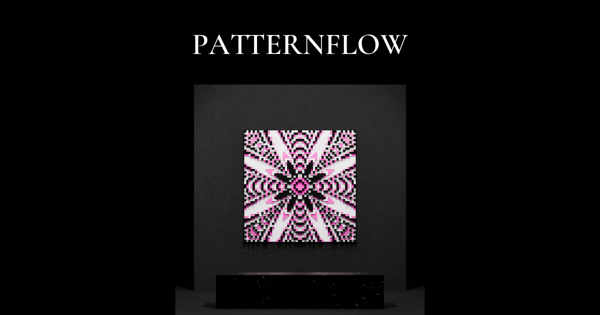

**English** | [한국어](README.ko.md)

# Patternflow

**Time To Find Meaning**

Patternflow offers an experience of subtraction and discovery. Design unique parametric wall art with our interactive generative tool. Where noise becomes form.

[Live Demo](https://patternflow.work) · [Studio](https://patternflow.work/studio) · [About](https://patternflow.work/about)



---

## Concept

**Where Noise Becomes Form**

Patternflow offers an experience of subtraction and discovery.

When the density of mathematical waves is pushed to the extreme, complex and dense patterns emerge. It is overwhelming, much like the ceaseless flow of modern information. When this continuous field is sampled with a regular grid and given height and color, a new form is revealed. What was once overwhelming transforms into legible masses and rhythms.

**The grid is not merely a technical tool—it is a lens that determines what can be seen.**

---

## Features

- **Interactive Pattern Generation** — Real-time manipulation of wave functions, grid density, and visual parameters
- **Multiple Export Formats** — PNG for digital use, OBJ/STL for 3D printing
- **Curated Archive** — Browse discovered forms materialized as relief sculptures
- **Physical Output** — Designed for fabrication as 3D printed wall art

---

## Tech Stack

| Layer | Technology |
|-------|------------|
| Rendering | Three.js, WebGL, React Three Fiber |
| Shaders | Custom GLSL |
| Framework | React 19, Vite |
| Styling | Tailwind CSS (CDN), CSS Modules |
| Deployment | Vercel |

---

## Getting Started

### Prerequisites

- Node.js 18+
- npm or yarn

### Installation

```bash
# Clone the repository
git clone https://github.com/engmung/patternflow.git

# Navigate to directory
cd patternflow

# Install dependencies
npm install

# Start development server
npm run dev
```

### Build

```bash
npm run build
```

---

## Usage

1. **Adjust Parameters** — Use sliders to control scale, grid resolution, and height
2. **Find the Threshold** — Push density to extremes, then sample with the grid
3. **Discover Form** — Watch when noise becomes legible pattern
4. **Export** — Save as PNG or OBJ for 3D printing

---

## Philosophy

> *"How you look determines what you see."*

In an age where algorithms endlessly pour out information, we are overwhelmed by seeing and hearing the same things. Through the practice of finding your own perspective, I hope you discover your own unique beauty in this flow.

Read more: [About Patternflow](https://patternflow.work/about)

---

## Author

**Seung Hun Lee**

Seoul-based artist working at the intersection of code, 3D graphics, and fabrication. Currently majoring in Visual Communication Design at Hongik University in South Korea.

- Portfolio: [lshsprotfolio.netlify.app](https://lshsprotfolio.netlify.app/en)
- Instagram: [@patternflow.work](https://instagram.com/patternflow.work)
- Project: [patternflow.work](https://patternflow.work)

---

## License

This work is licensed under [CC BY-NC 4.0](https://creativecommons.org/licenses/by-nc/4.0/)

**You are free to:**
- **Share** — copy and redistribute the material in any medium or format
- **Adapt** — remix, transform, and build upon the material

**Under the following terms:**
- **Attribution** — You must give appropriate credit to Seung Hun Lee, provide a link to the license, and indicate if changes were made
- **NonCommercial** — You may not use the material for commercial purposes

**Commercial Use:**  
For commercial licensing inquiries, contact: lsh678902@gmail.com

© 2026 Seung Hun Lee. All rights reserved.

---

## Acknowledgments

- [Three.js](https://threejs.org/) for WebGL rendering
- [React Three Fiber](https://docs.pmnd.rs/react-three-fiber) for React integration
- Inspired by the work of Carsten Nicolai, Casey Reas, and Anders Hoff

---

<p align="center">
  <i>Discovered forms, materialized.</i>
</p>