# Patternflow v1.0 — Build Guide

This guide walks you through building a Patternflow v1.0 from scratch. It assumes basic familiarity with soldering (through-hole + simple SMD) and 3D printing.

**Estimated build time:** 4–6 hours of active work, plus ~11 hours of 3D printing.

**Skill level:** Intermediate. If you've assembled a mechanical keyboard or built an Arduino project with SMD components, you're ready.

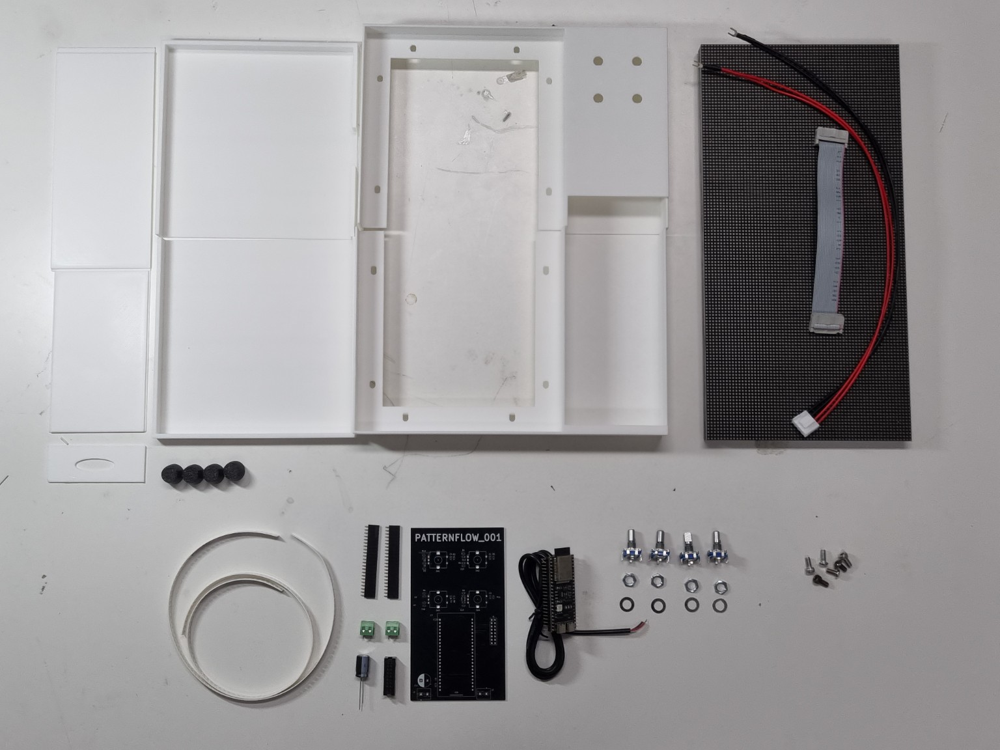

---

## Table of Contents

1. [Bill of Materials (BOM)](#1-bill-of-materials-bom)
2. [3D Printing](#2-3d-printing)
3. [PCB Assembly](#3-pcb-assembly)
4. [Case Assembly](#4-case-assembly)
5. [Final Integration](#5-final-integration)
6. [Firmware Upload](#6-firmware-upload)
7. [First Boot](#7-first-boot)
8. [Known Issues](#8-known-issues)

---

## 1. Bill of Materials (BOM)

### Main Components

| Ref | Item | Spec | Qty | Notes |
| --- | --- | --- | --- | --- |
| — | LED Matrix Panel | HUB75, 128×64 px, P2.5, 320×160 mm | 1 | Full color SMD. Ships with HUB75 ribbon cable + power cable — both used as-is. |
| U1 | ESP32-S3 DevKit | ESP32-S3-WROOM-1, **N16R8** (16MB Flash, 8MB PSRAM), 44-pin, 25.4mm header spacing | 1 | PSRAM is required |
| SW1–4 | Rotary Encoder | EC11, 5-pin, 20mm shaft, with push-switch | 4 |  |
| — | Female Pin Socket (1×22, 2.54mm) | For ESP32-S3 module | 2 |  |
| J1 | Box Header (2×8, 2.54mm) | Horizontal, for HUB75 ribbon | 1 | LED matrix data |
| J2 | Screw Terminal | 2-pin, 5mm pitch | 1 | +5V input from power bank |
| J3 | Screw Terminal | 2-pin, 5mm pitch | 1 | +5V output to LED matrix |
| R1–R12 | Resistor 10kΩ 1% | 0805 SMD | 12 | Encoder pull-ups (3 per encoder × 4) |
| C1–C10, C12–C15 | Capacitor 100nF X7R | 0805 SMD | 14 | 12 for encoders (3 per encoder × 4), 2 for ESP32 decoupling |
| C11 | Electrolytic Cap 1000µF / 16V | Radial D10×L13 | 1 | Main bulk decoupling |
| — | M4 Screws | ~10mm length | 6 | LED matrix mounting |
| — | USB Cable (sacrificial) | Any USB cable, will be cut | 1 | For 5V power input |
| — | Power Bank | Any standard USB power bank that physically fits | 1 | User-supplied |

### Sourcing — AliExpress (with affiliate links)

These are the exact links I used. **Purchasing through these affiliate links directly supports the ongoing development of Patternflow at no extra cost to you.** 

💡 **Found a better part?** If you discover cheaper, more reliable, or higher-quality alternative components, please let me know! I highly welcome PRs or GitHub Issues recommending better sourcing options for the community.

AliExpress shipping to most regions takes ~7–14 days.

- **Rotary Encoders (5-pack):** [EC11 20mm 5pcs — ~3,250 KRW](https://s.click.aliexpress.com/e/_c3dYYGob)
- **ESP32-S3-N16R8:** [~10,300 KRW](https://s.click.aliexpress.com/e/_c3qxYiaP)
⚠️ Make sure it's the **N16R8** variant. Other variants without PSRAM will not work reliably.
- **LED Matrix:** [Full color 320×160mm P2.5 HUB75 — ~23,250 KRW](https://s.click.aliexpress.com/e/_c3SVdcQr)

PCB: order from your preferred fab using the KiCad files in `hardware/pcb/`. I used PCBway (sponsored).

### What you also need (not in BOM)

- 3D printer (I used Bambu P1S)
- White and black PLA filament
- Soldering iron, solder, flux, tweezers
- Wire cutters or strong nippers (for trimming the LED matrix back)
- Cyanoacrylate glue (super glue)
- Phillips screwdriver

---

## 2. 3D Printing

### Files (in `hardware/case/`)

| File | Contents | Color | Print Orientation |
| --- | --- | --- | --- |
| `v1_1.stl` | Main body (vertical, tall part) | White | Vertical (standing up) |
| `v1_2.stl` | Back covers and internal divider plates | White | Flat |
| `v1_3.stl` | All 4 knobs (one file) | Black | Standard |

**Print all three files. Each is one print job.** Knobs are bundled in a single STL — printing `v1_3.stl` once gives you all four.

### Print Settings

I used a **Bambu P1S** with default settings, with one tweak:

- **Nozzle:** 0.4mm
- **Layer height:** Default (0.2mm)
- **Infill:** Default
- **Support:** Default tree support disabled. Use **standard (regular) support** instead.
- **Brim:** Off
- **Aux fan:** Lower to ~20%
- **Total print time:** ~11 hours combined

The main body (`v1_1`) is the long, thin part. I orient it standing up — this is the orientation the slicer will probably default to. Supports are needed and easy to remove.

> **Why standard supports, not tree:** During earlier prototypes I found tree supports more troublesome on this geometry. Standard supports remove cleanly here.
> 

---

## 3. PCB Assembly

Solder SMD parts first, then through-hole.

### 3.1 SMD Pass (R1–R12, C1–C6, C11)

**Order: by component type.** Do all resistors first, then all capacitors (or vice versa). Mixing types makes it easier to mis-place parts.

> ⚠️ **Silkscreen note:** On v1.0 PCB, the silkscreen does not clearly mark which 0805 pad is a resistor vs a capacitor. **Rule of thumb: the 0805 pad closest to each rotary encoder pad is a capacitor (C1–C4). The other 0805 pads are resistors.** When in doubt, refer to the schematic in `hardware/pcb/`. This will be fixed in v1.1.
> 

**Technique:**

1. Apply flux to one pad of each SMD position.
2. Tin one pad with a small amount of solder.
3. Hold the SMD with tweezers, slide it onto the tinned pad, reflow.
4. Solder the opposite pad.
5. Move on to the next part of the same type.

**Iron temperature:** ~420°C is what I used. Default works fine.

**Keep parts flat and centered.** Slight tilt will not affect function but looks bad.

### 3.2 Through-Hole Pass

Solder, in order:

1. **Female pin sockets (1×22 ×2)** for ESP32-S3 — these go on the front of the PCB. The ESP32 module plugs into these later (do not solder the ESP32 directly).
2. **J1 (HUB75 box header), J2 (USB power input), and J3 (LED matrix power output)**.
3. **C11 (1000µF electrolytic)** — watch polarity (long lead = positive).
4. **Rotary encoders (SW1–SW4)** — these go on the **back** of the PCB. They mount facing outward so their shafts protrude through the case front.

> ⚠️ **CRITICAL — Encoder side matters.** Rotary encoders **must be soldered on the back of the PCB**, not the front. If you get this wrong, the shafts will not reach the case front panel and the build is non-functional. Desoldering through-hole components from a populated PCB is extremely difficult. **Check the side twice before soldering each encoder.**

Press all parts flush against the PCB and keep them perpendicular before soldering.

### 3.3 Plug in the ESP32-S3

Once the female sockets are soldered, plug the ESP32-S3-N16R8 module into them. **Do not solder the module directly** — keep it removable in case of replacement.

### 3.4 ESP32 Pin Reference (Custom PCB / Schematic Reference)

If you are designing your own PCB or verifying wiring manually, the table below lists every pin assignment for the ESP32-S3-WROOM-1 N16R8 DevKit as used in Patternflow v1.0. Numbering is top-to-bottom with the USB connector at the top.

#### Left Side (top → bottom)

| # | Pin | Function |
| --- | --- | --- |
| 1 | 3V3 | +3.3 V supply |
| 2 | 3V3 | +3.3 V supply |
| 3 | RST | Not connected (NC) |
| 4 | IO4 | ENC1_A |
| 5 | IO5 | ENC2_A |
| 6 | IO6 | ENC3_A |
| 7 | IO7 | ENC4_A |
| 8 | IO15 | ENC2_SW |
| 9 | IO16 | ENC3_B |
| 10 | IO17 | ENC3_SW |
| 11 | IO18 | ENC4_B |
| 12 | IO8 | ENC1_B |
| 13 | IO3 | Not connected (NC) |
| 14 | IO46 | HUB_A |
| 15 | IO9 | ENC1_SW |
| 16 | IO10 | ENC2_B |
| 17 | IO11 | HUB_B |
| 18 | IO12 | HUB_D |
| 19 | IO13 | HUB_B2 |
| 20 | IO14 | HUB_OE |
| 21 | 5V | +5 V input |
| 22 | GND | GND |

#### Right Side (top → bottom)

| # | Pin | Function |
| --- | --- | --- |
| 23 | GND | GND |
| 24 | TX | Not connected (NC) |
| 25 | RX | Not connected (NC) |
| 26 | IO1 | ENC4_SW |
| 27 | IO2 | HUB_CLK |
| 28 | IO42 | HUB_R1 |
| 29 | IO41 | HUB_G1 |
| 30 | IO40 | HUB_B1 |
| 31 | IO39 | HUB_G2 |
| 32 | IO38 | HUB_R2 |
| 33 | IO37 | NC (PSRAM internal) |
| 34 | IO36 | NC (PSRAM internal) |
| 35 | IO35 | NC (PSRAM internal) |
| 36 | IO0 | Not connected (NC) |
| 37 | IO45 | Not connected (NC) |
| 38 | IO48 | HUB_C |
| 39 | IO47 | HUB_LAT |
| 40 | IO21 | HUB_E |
| 41 | IO20 | Not connected (NC) |
| 42 | IO19 | Not connected (NC) |
| 43 | GND | GND |
| 44 | GND | GND |

> IO35–IO37 are internally connected to the PSRAM on the N16R8 variant. Do not use these pins for external connections.

---

## 4. Case Assembly

The case prints in halves because it's too tall for most printers in one piece. You'll bond the halves first, then assemble.

### 4.1 Bond the case halves

The body and the back panel each come in upper and lower halves.

1. **Main body (front+sides):** Apply super glue along the seam between the upper and lower halves of the main body. Press firmly until set.
2. **Back panel:** Same — bond upper and lower halves of the back panel.

Allow ~5 minutes to fully cure before handling.

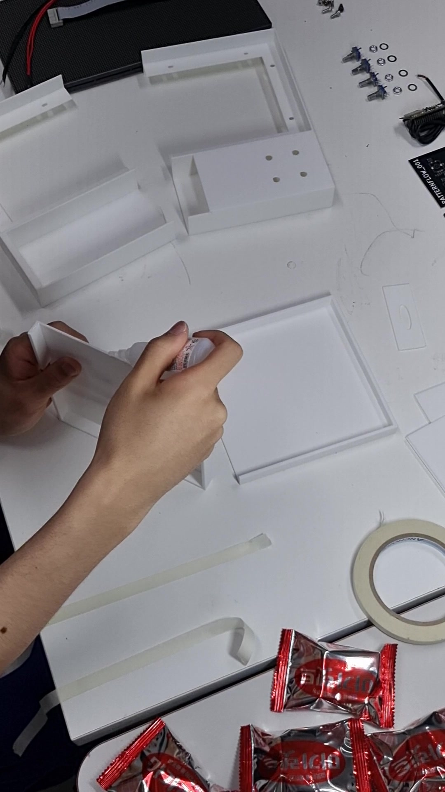

### 4.2 Trim the LED matrix mounting bumps

The LED matrix has two small alignment bumps on its back, diagonally opposite each other. These prevent it from sitting flat against the case.

**Cut them off with strong nippers or pliers.** Slight residual nubs are fine — flat enough is flat enough.

> A future case revision will include recesses for these bumps so trimming isn't needed.

<table><tr>
<td>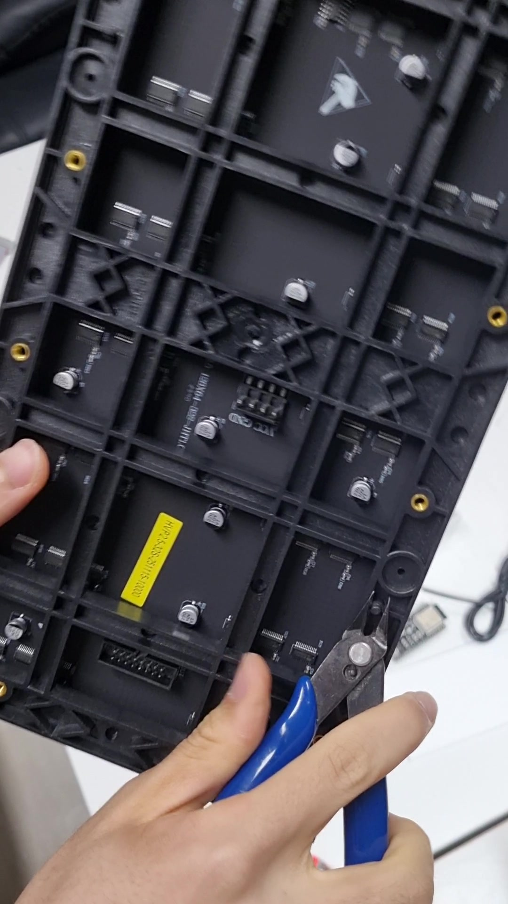</td>
<td>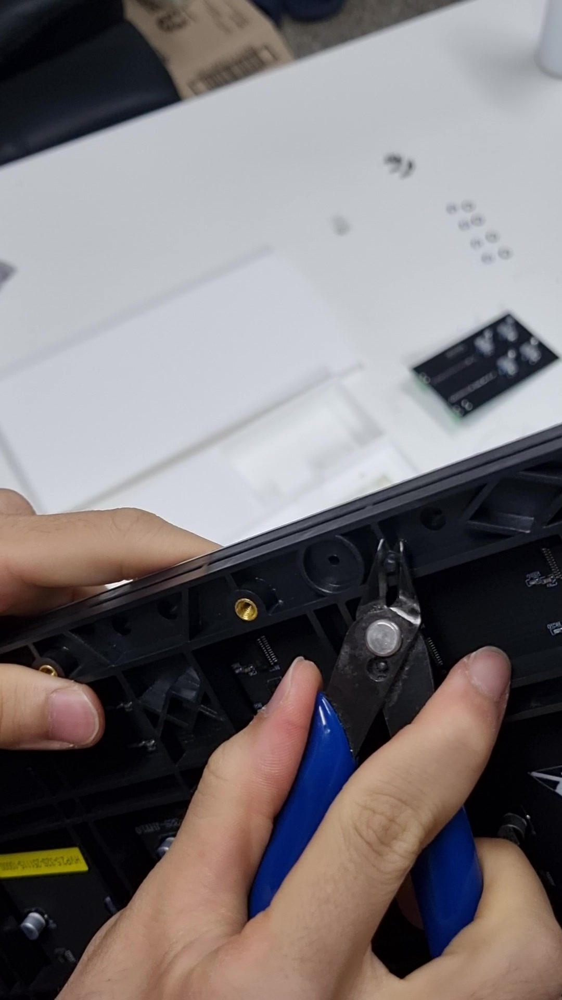</td>
</tr></table>

### 4.3 Bond the internal divider

Inside the case, there's an internal divider that separates the LED matrix volume from the electronics+power bank volume. The divider has a hole for the USB cable to pass through.

**Insert the divider from the front side (the power bank / lower side), sliding it up into position.** Apply super glue along the divider edges to bond it to the case interior. Do not insert it from the back.

### 4.4 Mount the LED matrix

1. From the front of the case, lower the LED matrix into its slot.
2. Flip the case over.
3. From the back, secure the matrix with the M4 screws (× 6).

> The screws thread directly into the LED matrix's mounting holes. Don't over-tighten.

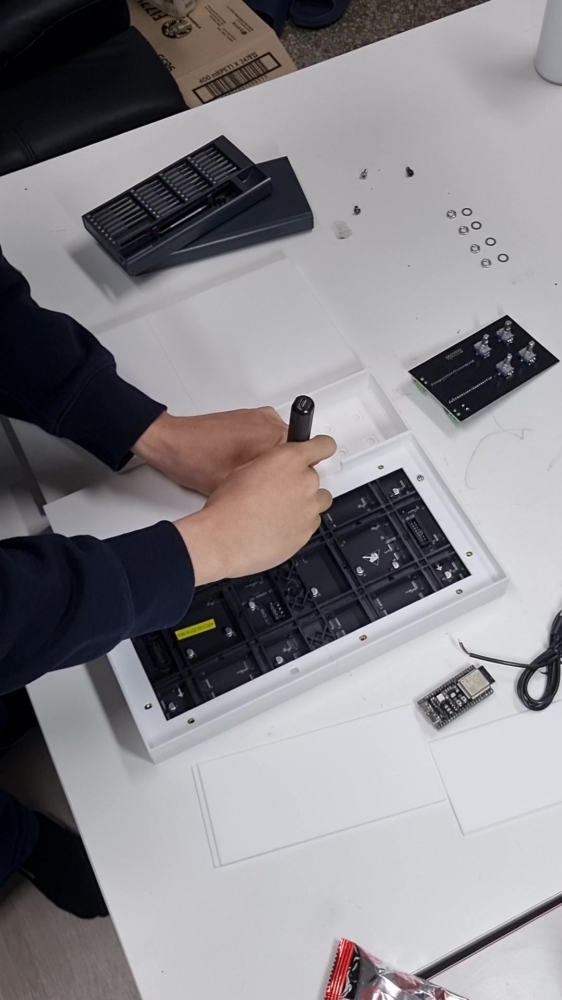

---

## 5. Final Integration

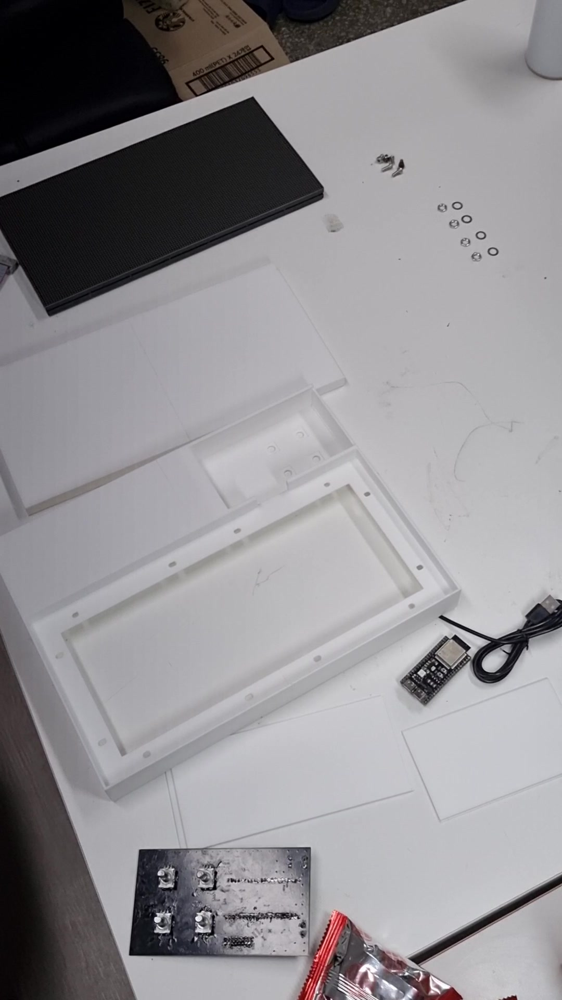

### 5.1 Insert the PCB

The PCB sits in the dedicated PCB slot, with the rotary encoders facing through the case front.

The slot is intentionally tight in v1.0. To install:

1. Hold the PCB at an angle, encoder side down.
2. Slide the bottom row of encoders into their slots first.
3. While tilting the PCB into a flat position, guide the upper encoders into their slots simultaneously.
4. Push the PCB flat against the case interior.

<table><tr>
<td><video src="build-guide/images/pcb_insert.webm" autoplay loop muted playsinline width="100%"></video></td>
<td>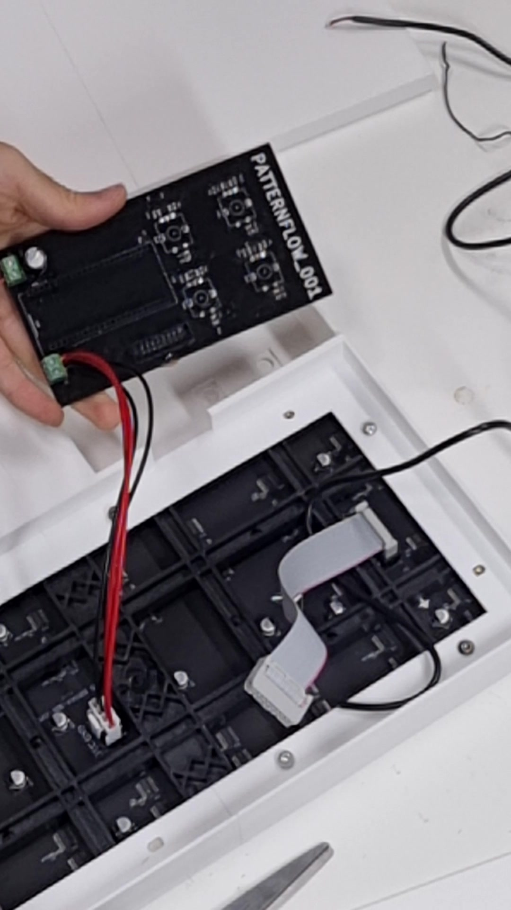</td>
</tr></table>

### 5.2 Secure the encoders

From the front of the case, attach each rotary encoder's nut and tighten with a wrench or pliers. This both secures the encoder shafts to the front face and locks the PCB in place.

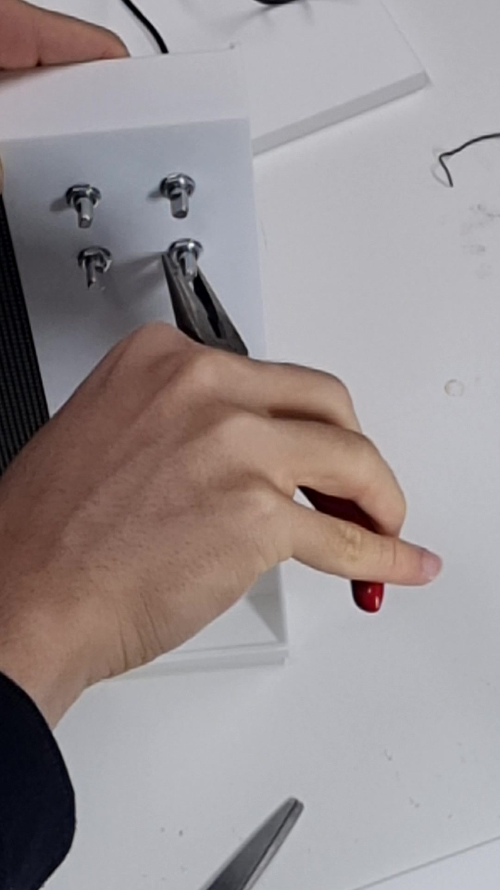

### 5.3 Attach the back cover

Slide the back cover panel into place along the rear of the case.

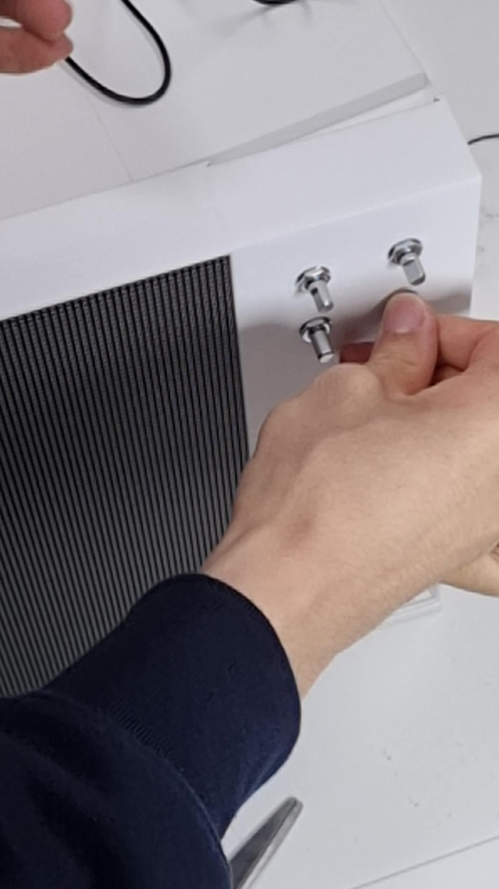

### 5.4 Attach the knobs

Press-fit the four black knobs onto the encoder shafts.

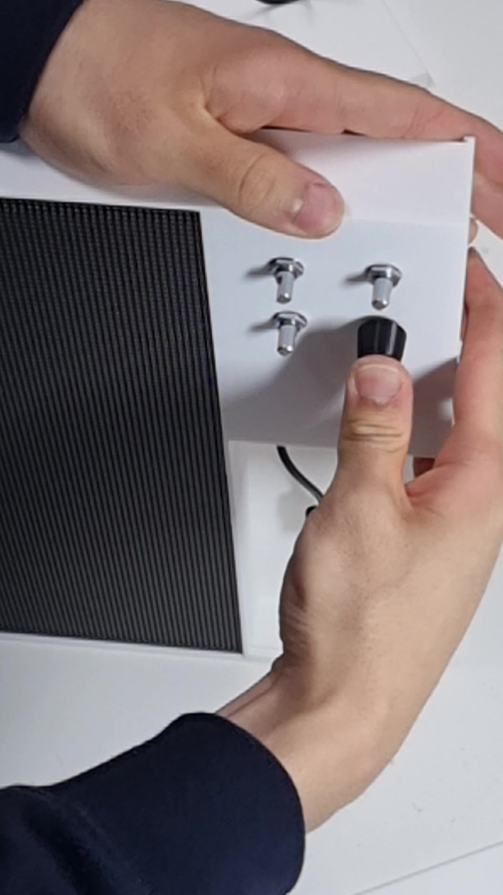

### 5.5 Connect the LED matrix

The LED matrix ships with two cables:

- **HUB75 ribbon cable** (data) — connect from `J1` on the PCB to the LED matrix data input.
- **Power cable** (red/black) — connect to `J3` on the PCB. Either cut the connector off and screw the wires into the J3 terminal, or use the cable as-is if the bare end fits.

> ⚠️ Watch polarity on the J3 power cable — red to +5V, black to GND.

### 5.6 Wire the USB power input

Cut the USB cable short — trim it to a length that routes through the divider hole without excessive slack. Strip the +5V (red) and GND (black) wires.

<table><tr>
<td>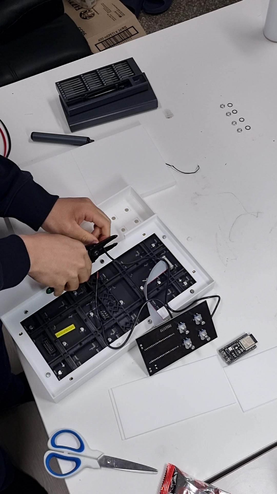</td>
<td>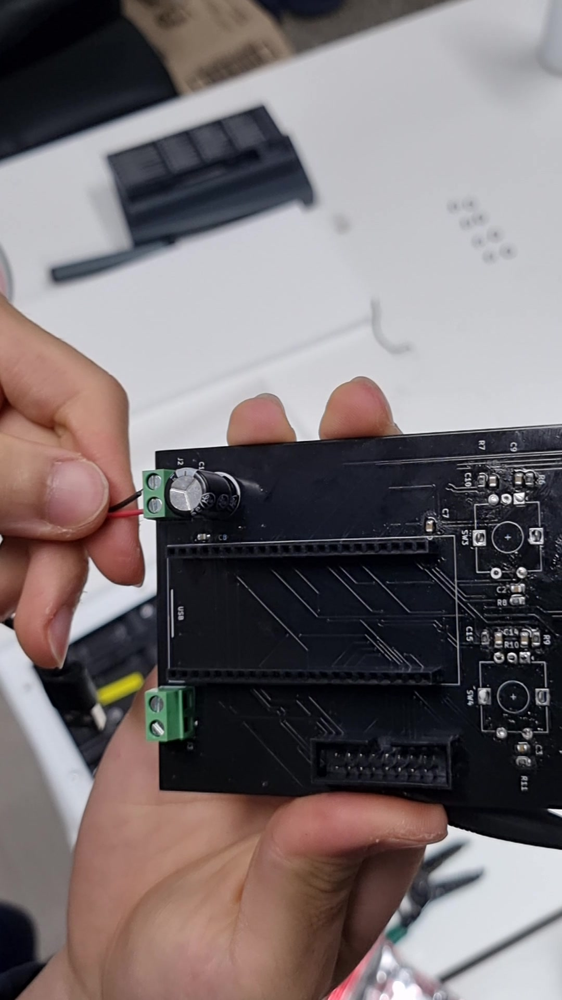</td>
<td>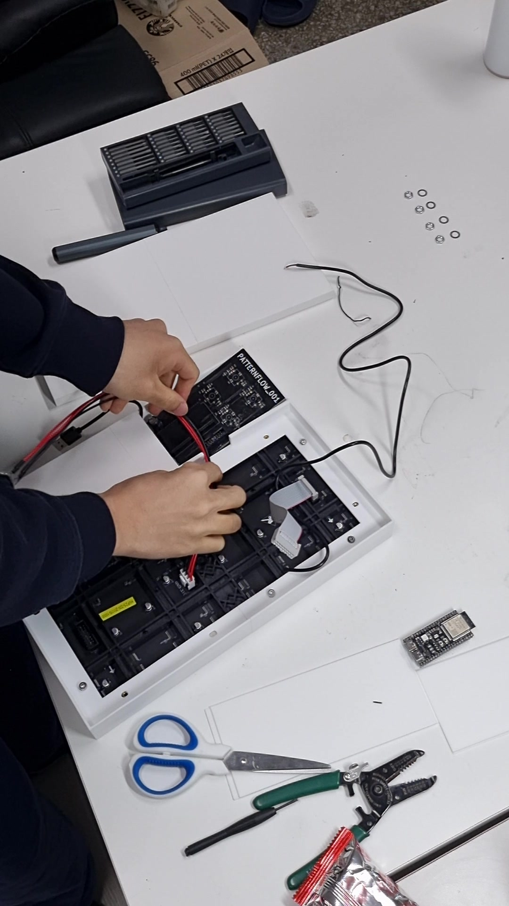</td>
</tr></table>

> J2 (input) and J3 (output to LED matrix) are connected internally on the PCB. You don't need to bridge them externally — the PCB handles +5V distribution.

### 5.7 Close the PCB compartment

Slide the PCB compartment cover panel into its slot to close off the electronics section.

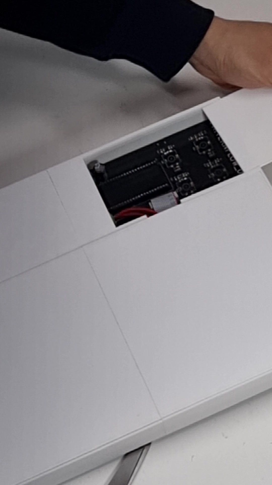

### 5.8 Slide in the power bank cover

Insert the user's power bank into the compartment, then slide the battery cover in to hold everything in place.

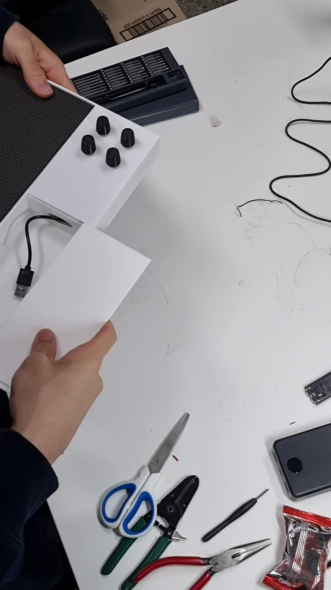

---

## 6. Firmware Upload

There are two ways to flash firmware onto your Patternflow: the browser-based flasher (recommended, no toolchain needed) or Arduino IDE for manual/custom builds.

### 6.1 Browser Flash (Recommended)

No installation required. Works on any desktop with Chrome or Edge.

1. Visit **[patternflow.work](https://patternflow.work)** on a desktop browser.
2. Connect your ESP32-S3 **separately** to your computer via a USB-C data cable — do not insert it into the PCB yet.
3. Scroll to the **Patterns** section and click **"Flash Patternflow v1 (All Patterns)"**.
4. Select the correct serial port when prompted and follow the on-screen steps.

<table><tr>
<td>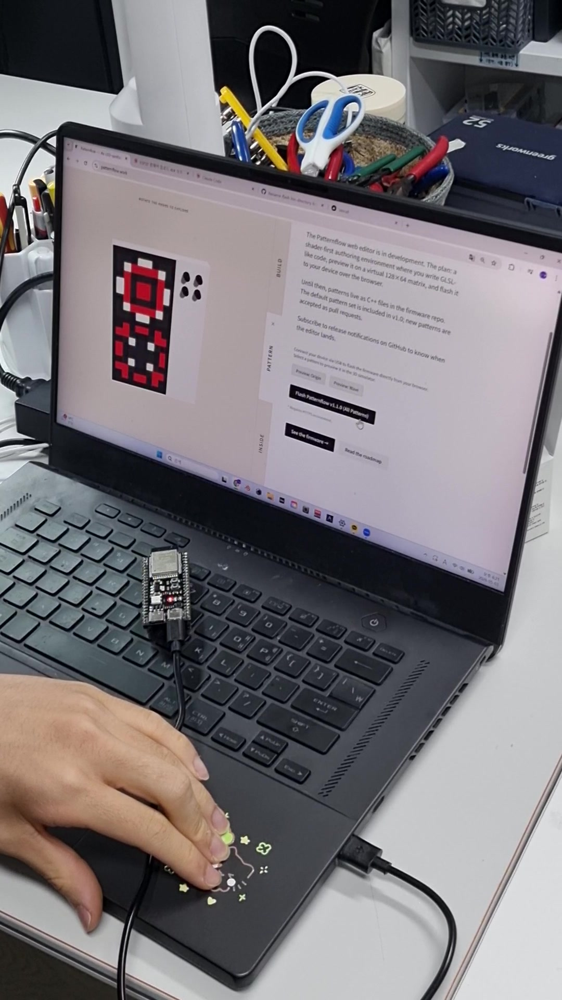</td>
<td>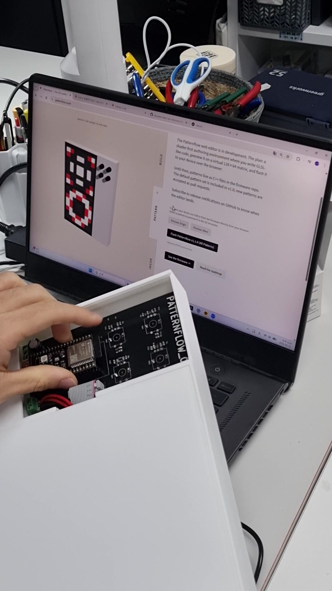</td>
</tr></table>

> ⚠️ The Web Serial API is only supported on **desktop Chrome and Edge**. Firefox and Safari are not supported.

### 6.2 Arduino IDE (Manual / Custom Builds)

Use this method if you want to modify the firmware source, or if the browser flasher does not work for your setup.

#### Prerequisites

- Arduino IDE (latest version)
- ESP32 board package installed (Tools → Board → Boards Manager → search "esp32")

#### Board Settings

In Arduino IDE, **Tools** menu:

- **Board:** ESP32S3 Dev Module
- **PSRAM:** OPI PSRAM
- **Flash Size:** 16MB
- **Partition Scheme:** 16M Flash (3MB APP/9.9MB FATFS) or similar with PSRAM-aware partition
- **USB CDC On Boot:** Disabled
- **Upload Mode:** UART0 / Hardware CDC

#### Upload

1. Connect the ESP32-S3 module to your computer with a USB-C data cable.
2. Select the correct port under **Tools → Port**.
3. Open `firmware/patternflow_v1/patternflow_v1.ino`.
4. Check `firmware/patternflow_v1/config.h` to adjust pin mappings, brightness, or pattern limits if needed.
5. Click **Upload**.

If the upload fails, hold **BOOT** on the ESP32-S3 while pressing **RESET**, then click Upload again.

### 6.3 OTA (Preview)

OTA updates work via Arduino IDE's network port option once the device has been on the same Wi-Fi network at least once. **OTA in v1.0 is functional but not the recommended path.** Use the browser flasher or wired upload as the primary method.

---

## 7. First Boot

1. Plug the user's power bank into the USB cable wired into J2.
2. **Press the RESET button on the ESP32-S3 module once.**
3. The LED matrix should illuminate with the default pattern.
4. Turn the four knobs to confirm they all respond.

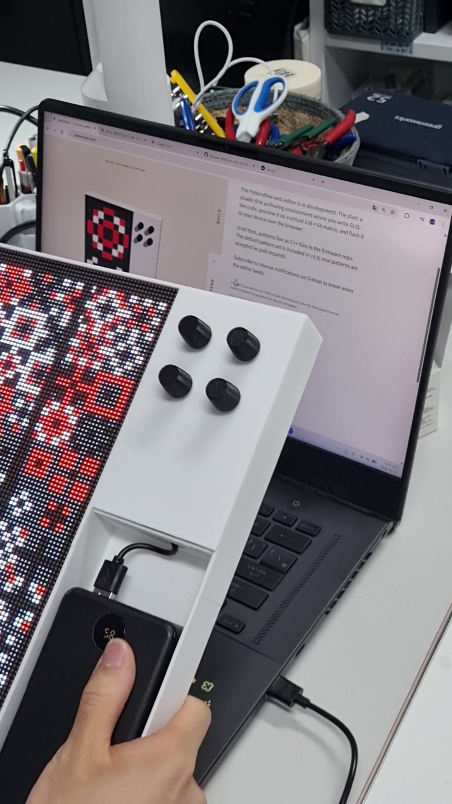

> The reset-button-on-first-boot step is a known v1.0 issue (see below). A fix is planned.

---

## 8. Known Issues

### Issue #1 — Reset button required on power-up

**Why:** The 3.3V rail rises slowly enough that the EN pin's RC time constant misses the boot window. Common to ESP32-S3 boards without an explicit EN-GND cap.
**Workaround (v1.0):** Press RESET once after applying power.
**Planned fix (v1.1):** Add a 0.1µF–1µF ceramic cap between EN and GND, either via PCB revision or a hand-soldered SMD cap on the module.
🛠 **Open to PRs** — see the GitHub Issues tab.

### Issue #2 — Encoder direction reversed in firmware

**Why:** Encoder footprint in v1.0 PCB is rotated relative to the intended orientation.
**Workaround (v1.0):** Firmware inverts the sign — invisible to the user.
**Planned fix (v1.1):** Correct PCB footprint orientation.

### Issue #3 — SMD silkscreen ambiguity (R vs C)

**Why:** Silkscreen on v1.0 doesn't clearly distinguish 0805 caps from 0805 resistors.
**Workaround:** Use the rule of thumb above (cap = closest 0805 to each encoder) or refer to the schematic.
**Planned fix (v1.1):** Updated silkscreen.

### Issue #4 — LED matrix back has alignment bumps

**Why:** The matrix manufacturer leaves two small alignment bumps on the back.
**Workaround (v1.0):** Cut them off during assembly.
**Planned fix (v1.x):** Case recess to accommodate them.

### Issue #5 — Encoder shaft length

**Note:** The encoders in the BOM use 20mm shafts. Earlier notes mentioned 15mm as a possible alternative — **ignore this; 20mm is the correct and intended length.** The 3D-printed knobs and case are modeled for 20mm shafts and will fit correctly. Use the linked EC11 20mm part from the sourcing list.

---

## Questions, contributions, fixes

This is v1.0. It works. It also has known rough edges, all listed above.

If you build one — please open an issue on GitHub with photos and any notes. If something in this guide was unclear or wrong, send a PR. If you fix one of the Known Issues, you'll be credited as a contributor.

— SeungHun